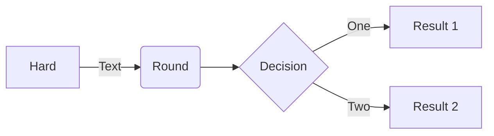

# Markdown

To use the Markdown you need to set the snippet language in **"Markdown"**. To do this, click on the language selector located at the bottom left of the editor panel, and choose **"Markdown"** from the drop-down list.

## Preview Markdown

Follow one of the following steps:

- Select **"Markdown"** > **"Preview Markdown"** from the menu bar.
- Click **"<svg xmlns="http://www.w3.org/2000/svg" width="16" height="16" viewBox="0 0 24 24" fill="none" stroke="currentColor" stroke-width="2" stroke-linecap="round" stroke-linejoin="round" class="feather feather-eye"><path d="M1 12s4-8 11-8 11 8 11 8-4 8-11 8-11-8-11-8z"></path><circle cx="12" cy="12" r="3"></circle></svg>"** button on the top right corner of the editor

## Presentation Mode

<AppVersion text=">=3.2" />

Presentation mode allows you to make a presentation out of a sequence of snippets.

Follow these steps:

- Create or select a folder where snippets will be placed
- Add snippets and set the `markdown` language for them

## Mindmap

<AppVersion text=">=3.10" />

massCode automatically converts Markdown to Mindmap.

Follow one of the following steps:

- Select **"Markdown"** > **"Preview Mndmap"** from the menu bar.
- Click **"<svg xmlns="http://www.w3.org/2000/svg" width="16" height="16" style="transform: rotate(90deg)" viewBox="0 0 24 24"><path fill="currentColor" d="M17 6.06a3 3 0 0 0-1.15 5.77A2 2 0 0 1 14 13.06h-4a3.91 3.91 0 0 0-2 .56V7.88a3 3 0 1 0-2 0v8.36a3 3 0 1 0 2.16.05A2 2 0 0 1 10 15.06h4a4 4 0 0 0 3.91-3.16A3 3 0 0 0 17 6.06Zm-10-2a1 1 0 1 1-1 1a1 1 0 0 1 1-1Zm0 16a1 1 0 1 1 1-1a1 1 0 0 1-1 1Zm10-10a1 1 0 1 1 1-1a1 1 0 0 1-1 1Z"/></svg>"** button on the top right corner of the editor or press <kbd>Shift+Cmd+I</kbd> on macOS or <kbd>Shift+Ctrl+I</kbd> on Windows or Linux.


## Image Embedding

<AppVersion text=">=3.1" />

Follow one of the following steps:

- Copy the image file on your computer and paste it directly into the editor
- Specify the path to the image ``

::: warning
When manually inserting an image, the image must first be copied to the `/assets` folder where the [storage](/documentation/storage.html) is located.
:::

## Mermaid Diagrams

<AppVersion text=">=2.7" />

### Use

````

````


::: tip
To learn more about the syntax, please refer to <AppLink href="https://mermaid-js.github.io/mermaid/#/?id=diagram-types">Mermaid documentations</AppLink>.
:::

## Render Code Blocks

<AppVersion text=">=3.2" />

You can choose what you want the code blocks to be rendered with.

There are two choices: <AppLink href="https://highlightjs.org/">highlight.js</AppLink> and <AppLink href="https://codemirror.net/5/">Codemirror</AppLink> (this editor is the basis of massCode).

If you use Codemirror as rendering for code blocks you will get a 1:1 match with how the syntax is highlighted in massCode. When you do this, you need to specify the language for the blocks according to the <AppLink href="https://github.com/massCodeIO/massCode/blob/master/src/renderer/components/editor/languages.ts">values</AppLink> that the editor itself uses. For example `javascript` instead of `js`.

<script setup>
import { withBase } from 'vitepress'
</script>
